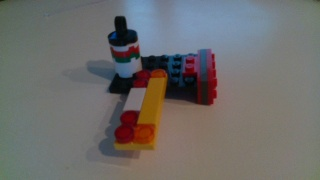
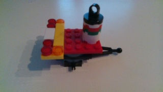
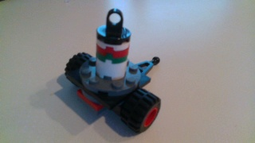
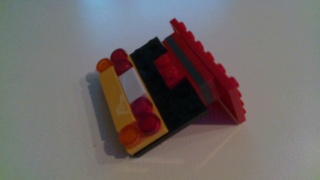

# Human_Motion_Data_Assembly_Tasks
## Task Description
This data includes 5 tasks. Each task requires the human to use LEGO pieces to assemble an object. The goal objects are different for different tasks, but they may share common LEGO pieces. For each trial, the human subject was given one of the following goal images. The human then used the component pieces on the table to assemble the goal object based on his/her understanding.

### Task Goal Objects

### Sample Assembly Trial
Click for the video.

## Data Collection
The motion data was recorded using the [Intel RealSense D415](https://www.intelrealsense.com/depth-camera-d415/). The human motion was extracted from the raw data using the [OpenPose](https://github.com/CMU-Perceptual-Computing-Lab/openpose).

## Data Format
The data focuses on the human arm motion throughout the tasks, including the shoulders, elbows, and wrists. The data is stored as trajectories of the joints. 
The trajectory profiles are in the form of (Left Wrist XYZ, Right Wrist XYZ, Left Elbow XYZ, Right Elbow XYZ, Left Shoulder XYZ, Right Shoulder XYZ).
